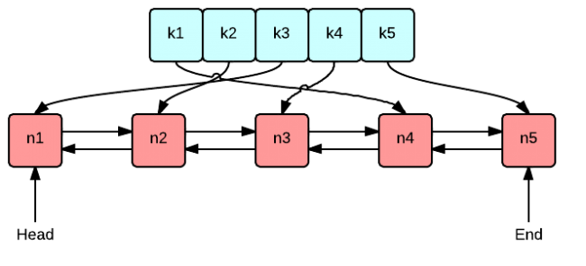

# LRU cache

This is a simple implementation of a Least Recently Used(LRU) cache class. Both `put(...)` and `get(...)` functions run in O(1) time. The space used by the class is linear in terms of the number of objects stored.

## Algorithm and data structures used

  1. A Hashmap and a doubly connected linked list are the main datastructures used.
  2. The linked list stores the keys in a least recently used order. (Head is the least recently used key, tail is the last used key).
  3. The Hashmap maps the keys to pointers to their nodes in the list, as shown in the above image.
  4. Values associated with keys are stored in another Hashmap.
  5. When `get(k)` is called, the node corresponding to k is moved to the tail.
  6. When `put(k, v)` is called, there are two separate cases:
    - <ins>`k` was already stored in the cache:</ins>
    Here, `k`'s corresponding node is moved to the tail, and the hashmap storing its value is updated.
    - <ins>`k` was  **not** already stored in the cache:</ins>
    Here, `k` is appended to the linked list. If this operation results in an overflow of the total number of items stored in the cache, the key stored in the head of the list is removed from the cache, and the head of the list becomes `head -> next`.

## Generic implementation

The LRUcache class is defined in a generic way:

    template <class K, class V>
    class LRU_Cache {
      ...
    };

This specification allows for the cache to be used for mapping any hashable type K to any type V.
